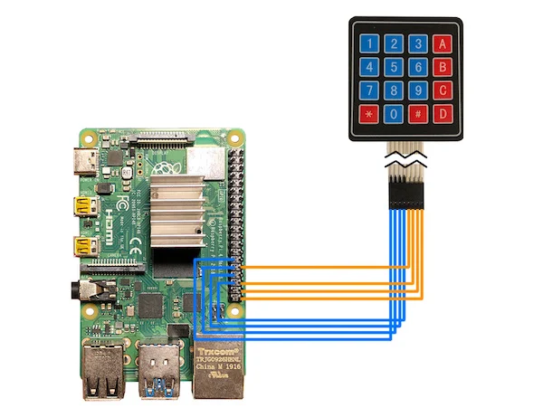
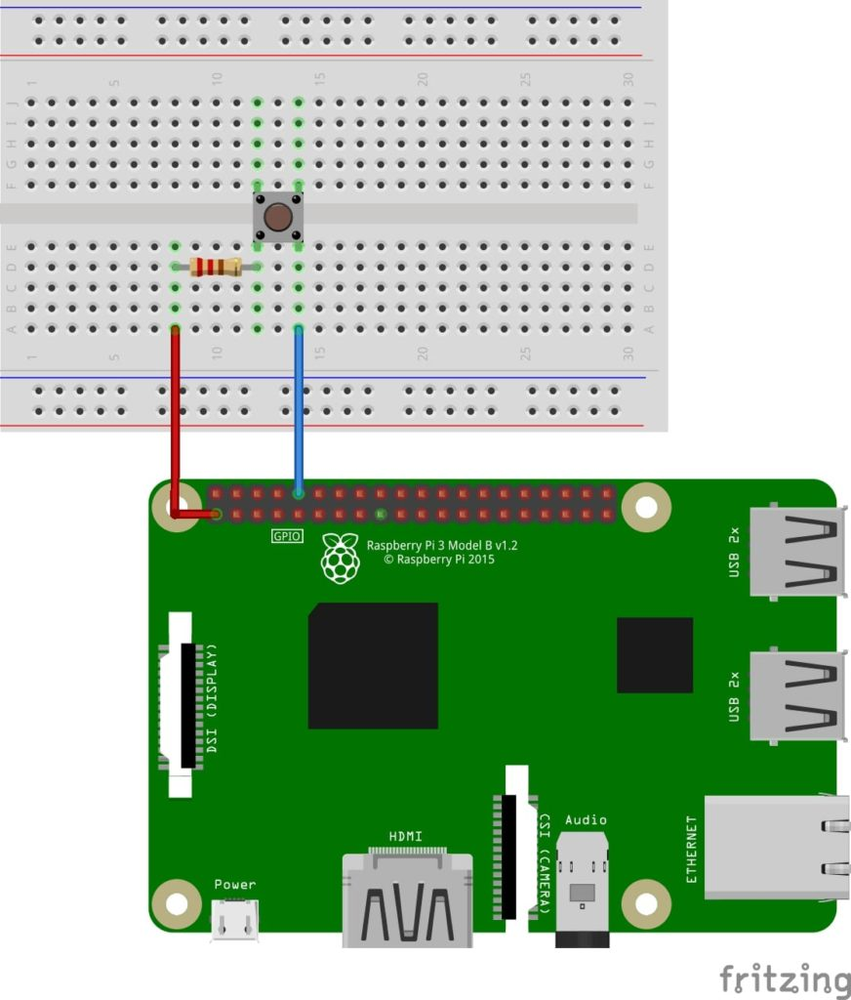

# Recogg - IoT


Recogg uses the Raspberry-Pi in conjunction with other hardware components to perform comprehensive facial detection, manipulate an LCD interface, and switch between states using a button. This automates the modern day attendance system and automatically update classroom attendance (stored in the cloud), eliminating the human error that can occur when manually taking attendance, especially in large classes.

### Features
* Accurate Facial Detection
* Capture Faces using Raspberry Pi Camera
* Update LCD Screen with Information
* Allow entry of a class uid using a keypad
* Turn On/Off using Button
* Mobile with a Portable Battery

### Architecture Diagram

.jpg)

<!-- BUILT WITH -->
### Built With


* [Python](https://www.python.org/)

## Getting Started

Learn how to set up a local IoT device and connect it to the API.

### Prerequisites

You will need the following hardware:

* [Raspberry Pi 4](https://www.raspberrypi.org/products/raspberry-pi-4-model-b/)
* [Camera](https://www.amazon.com/Raspberry-Pi-Camera-Module-Megapixel/dp/B01ER2SKFS/ref=sr_1_3?dchild=1&keywords=raspberry+pi+camera&qid=1592857047&sr=8-3)
* [Bread Board](https://www.amazon.com/EL-CP-003-Breadboard-Solderless-Distribution-Connecting/dp/B01EV6LJ7G/ref=sr_1_1_sspa?dchild=1&keywords=breadboard&qid=1595879460&sr=8-1-spons&psc=1&spLa=ZW5jcnlwdGVkUXVhbGlmaWVyPUExSDVaOVZTQjhRTE0xJmVuY3J5cHRlZElkPUEwNzA0MjMxMjU2VDhZOU45VzVFUiZlbmNyeXB0ZWRBZElkPUEwNTI0ODkxMTVLQVI1Vk9QVEE5OCZ3aWRnZXROYW1lPXNwX2F0ZiZhY3Rpb249Y2xpY2tSZWRpcmVjdCZkb05vdExvZ0NsaWNrPXRydWU=)
* [Button](https://www.amazon.com/6x6x6mm-Momentary-Push-Button-Switch/dp/B01GN79QF8/ref=sr_1_5?dchild=1&keywords=raspberry+pi+button&qid=1595879504&sr=8-5)
* [Wires](https://www.amazon.com/REXQualis-120pcs-Breadboard-Arduino-Raspberry/dp/B072L1XMJR/ref=sr_1_1_sspa?dchild=1&keywords=wires+for+raspberry+pi&qid=1595879217&sr=8-1-spons&psc=1&smid=AGKZJH7853EGJ&spLa=ZW5jcnlwdGVkUXVhbGlmaWVyPUEyT0lSUVIxWkQ0NzlYJmVuY3J5cHRlZElkPUEwMTE2MjU4MjI4SDNBUTVMMUo2TSZlbmNyeXB0ZWRBZElkPUExMDQ2NTg4MlZHREdTTUU1ODNIWiZ3aWRnZXROYW1lPXNwX2F0ZiZhY3Rpb249Y2xpY2tSZWRpcmVjdCZkb05vdExvZ0NsaWNrPXRydWU=)
* [10k Ω Resistor](https://www.amazon.com/EDGELEC-Resistor-Tolerance-Multiple-Resistance/dp/B07QJB31M7/ref=sr_1_1_sspa?dchild=1&keywords=10k+ohm+resistor&qid=1595879144&sr=8-1-spons&psc=1&spLa=ZW5jcnlwdGVkUXVhbGlmaWVyPUExRU9QVkQ5VzcxR1BDJmVuY3J5cHRlZElkPUEwMzQ5MDkwQTQwNlZFWTQzR0NMJmVuY3J5cHRlZEFkSWQ9QTA4MDc3MjEyQU1UQlZFV08xQUdMJndpZGdldE5hbWU9c3BfYXRmJmFjdGlvbj1jbGlja1JlZGlyZWN0JmRvTm90TG9nQ2xpY2s9dHJ1ZQ==)
* [20 x 4 I2C LCD Screen](https://www.amazon.com/dp/B01GPUMP9C/ref=twister_B0784SYKBM?_encoding=UTF8&psc=1)
* [4 x 4 Number Pad](https://www.amazon.com/YETAIDA-Arduino-Universial-Keyboard-Membrane/dp/B07Q7FW8B9/ref=sr_1_1_sspa?dchild=1&keywords=4x4+raspberry+pi+keypad&qid=1595878846&sr=8-1-spons&psc=1&spLa=ZW5jcnlwdGVkUXVhbGlmaWVyPUEzR0FYWFRWTklaNEY5JmVuY3J5cHRlZElkPUEwOTc4NDM2MTBPQzVPUldBREpUUiZlbmNyeXB0ZWRBZElkPUEwNTg1OTIxMkNQWjkzT0dBNkdHOCZ3aWRnZXROYW1lPXNwX2F0ZiZhY3Rpb249Y2xpY2tSZWRpcmVjdCZkb05vdExvZ0NsaWNrPXRydWU=)
* [Battery Pack](https://www.amazon.com/Battery-Pack-Raspberry-4000mAh-Suction/dp/B07BSG7V3J)

  
<!-- INSTALLATION -->
### Installation
1. Install [Python 3.6](https://www.python.org/downloads/release/python-360/)
2. Install Python libraries (Use the linux terminal on Raspberry-Pi) 
   * PIP installer for Python 3.6
   ```sh
   sudo apt-get install python3-pip
   ```
   * Latest version for the following libraries
   ```
   import cv2
   import numpy as np
   import requests
   import picamera
   from time import sleep
   import I2C_LCD_driver
   from time import *
   from time import sleep
   import RPi.GPIO as GPIO
   import keypad as kp
   ```
3. Clone the repo or obtain a zipped version of the repository
```sh
git clone https://github.com/your_username_/Recogg.git
```
4. Move the project folder to a secure location on your computer.

<!-- HARDWARE GUIDE -->
### Hardware Guide
* Raspberry-Pi setup
  * [Install Raspbian-OS](https://www.raspberrypi.org/documentation/installation/installing-images/)
  * Plug into keyboard and mouse, monitor (using HDMI), and power source
* [Keypad](https://maker.pro/raspberry-pi/tutorial/how-to-use-a-keypad-with-a-raspberry-pi-4)
* [LCD Screen](https://www.youtube.com/watch?v=F9IVtKa8C7Q)
* [Button](https://raspberrypihq.com/use-a-push-button-with-raspberry-pi-gpio/)
* [Camera](https://projects.raspberrypi.org/en/projects/getting-started-with-picamera)
* GPIO Pin Setup (Using BCM layout)
   * Keypad Pins (starting from the left)
      * Pin 1 - GPIO 5
      * Pin 2 - GPIO 6
      * Pin 3 - GPIO 13
      * Pin 4 - GPIO 19
      * Pin 5 - GPIO 12 
      * Pin 6 - GPIO 16
      * Pin 7 - GPIO 20 
      * Pin 8 - GPIO 21 
      
   * LCD Screen Pins
      * GND - GND
      * VCC - 5V 
      * SDA - SDA1
      * SCL - SCL
   * Button Pins
      * RXD0
      * 3.3V
   

### Final Steps

Finally, connect the API to the IoT device. Modify the following line in **pyface.py**.

```
```

Once you are done with this, run the python script **pyface.py** using Python 3.6. The IoT device should now be working.

<!-- USAGE EXAMPLES -->
## Usage

The IoT part of Recogg can be used for any kind of facial detection from an attendance system, to a door lock, to unlocking a computer. As this project is a prototype, we encourage improving it and using it for other purposes. **Make sure to list us as the original authors, especially if you use any of our code, documentation, or instructions.**

Ways to expand the Recogg - IoT:

* Create multiple IoT devices, all connected to the cloud
* 3D print a body for the IoT device and make it compact

_For more examples, please refer to the [Documentation](https://example.com)_

## More Information ##

For more information licenses, contributing, errors, and other components, visit the [front of the repository](https://github.com/ashayp22/Recogg).


