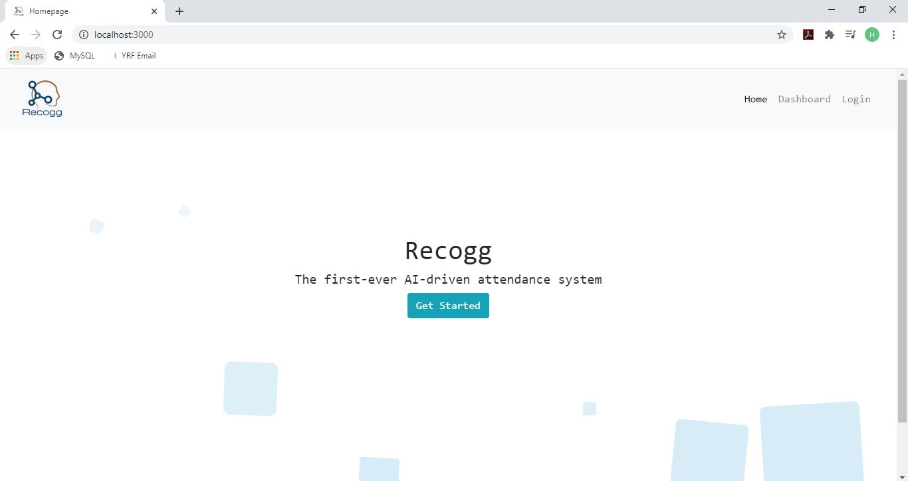
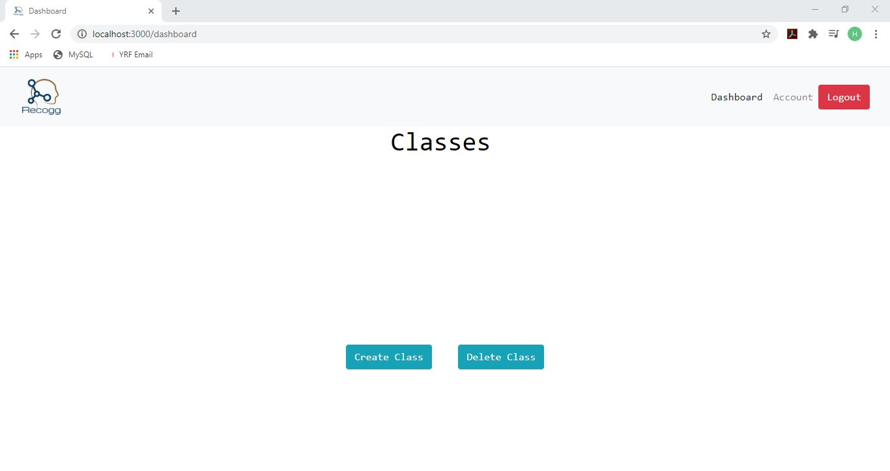
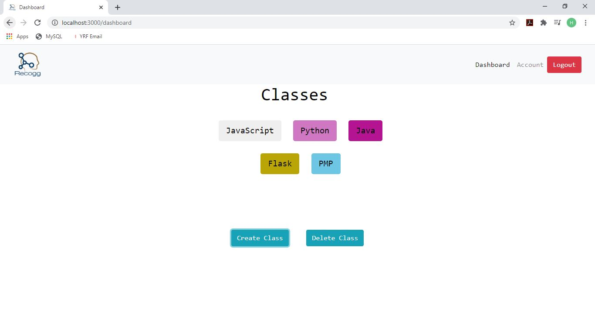
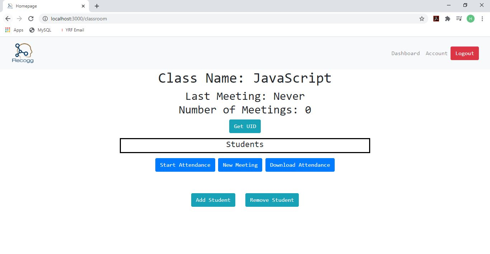
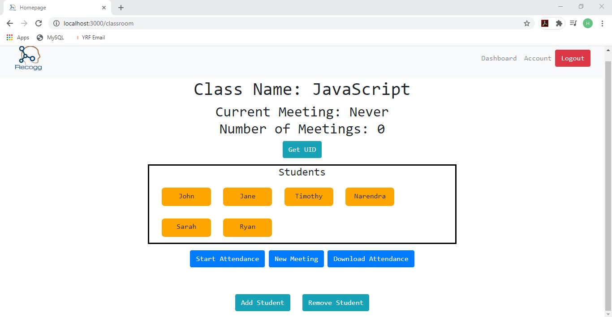
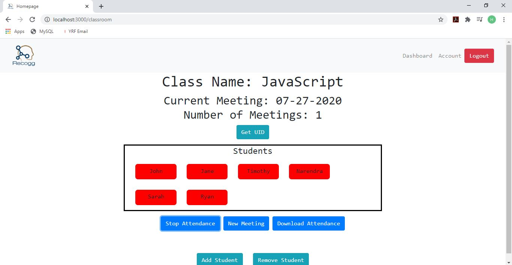
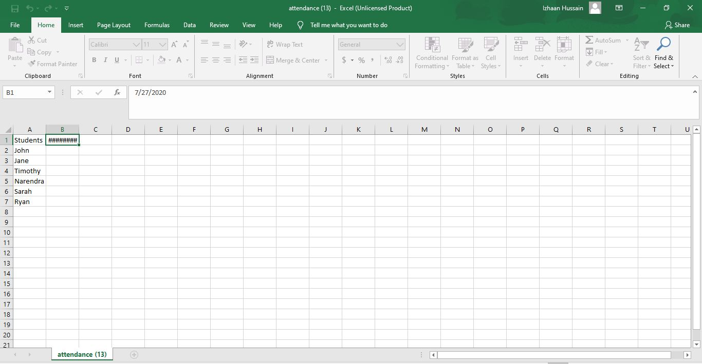
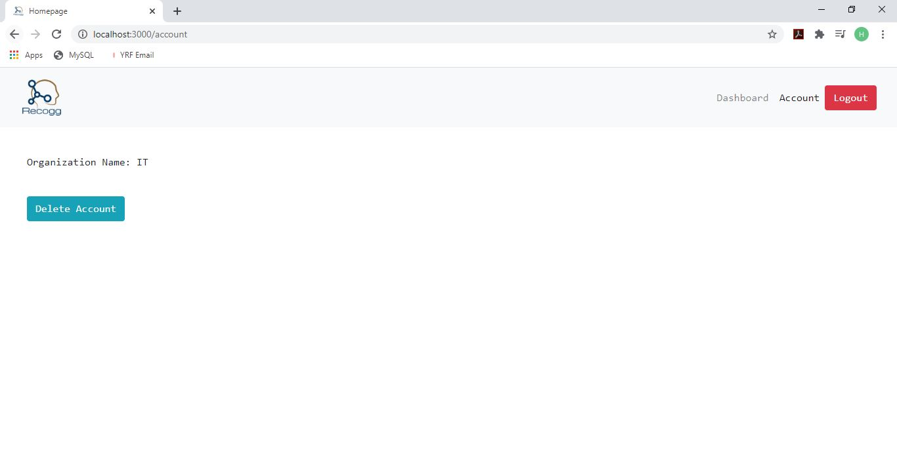

# Recogg - Web Interface

###  ###

### Summary ###
Through the web interface of Recogg, users are able to create classrooms and add students. The interface gives users the ability to track the attendance of each classroom live and create a spreadsheet for the class.

### Built With

1. Node JS
2. HTML
3. CSS
4. JavaScript
5. jQuery
6. Bootstrap

### Features

1. Teacher or administrator can create an account
2. Create classroom for each program/class the organization offers
3. Add students to each classroom
4. Track attendance of classroom live
5. Download spreadsheet with full attendance of class

## Getting Started

In order to run the interface, the user must install node js which can be found [here](https://nodejs.org/en/download/). They will also need to install npm which gets downloaded with node js. Once node js and npm are completely installed, user should download the full [Web-Interface folder](https://github.com/ashayp22/Recogg/tree/master/Web%20Interface).

### Prerequisites

User should open the command prompt and change the directory to match that of the web-interface folder.

Then type in the following command:
* npm
```sh
npm install npm@latest -g
```

### Running the Interface

In order to run the interface, the user must open up the command prompt and navigate to the web-interface folder. Once there, user should type the following command:

```sh
node app.js
```
User will then be prompted to go to [http://localhost:3000/](http://localhost:3000/), which the user should open up in their web browser.

## Usage

Once the user is in the web interface, they should click the button to get started:


Once the user creates an account, they will be redirected to the dashboard, which will display all of the classrooms, but is initially empty:


To create a classroom, user can click on the create class button and enter the class name. After adding in a few classes, the page will look similar to this:


If a user wants to delete a class, they can simply click on the delete class button and type in the class name.

To enter the classroom, the user can click on the button corresponding to the class they want to enter. Once there, the page will initially look similar to this:


To add students to the class, the user can click the add student button and type in the student's name and upload the photo of the student's face. To remove a student, the user can click on the remove student button and type in the student's name. After adding in the students' names, the classroom will look similar to this:


When it is time for a class to start, the teacher/administrator should click the new meeting button which will create a meeting corresponding to the current date. Then, the user should click the start tracking button. Once that happens, the user can track the attendance live; red means the student is not currently present, green means the student is currently present:


Once the teacher wants to stop tracking the attendance, they can click on the stop tracking button.

If the teacher wants a spreadsheet on which there is the attendance of each date that there was a meeting created, they can click on the download attendance button. Once the teacher opens the downloaded file, the spreadsheet will look like this:

If a student is present, there will be an x next to their name corresponding to each date there was a meeting. In the image above, no students were present.

If a user wants to delete an account, they can go on the account page which is accessible from the top navigation bar. Once there, the user can click the delete organization button:



## More Information ##

For more information licenses, contributing, errors, and other components, visit the [front of the repository](https://github.com/ashayp22/Recogg).


